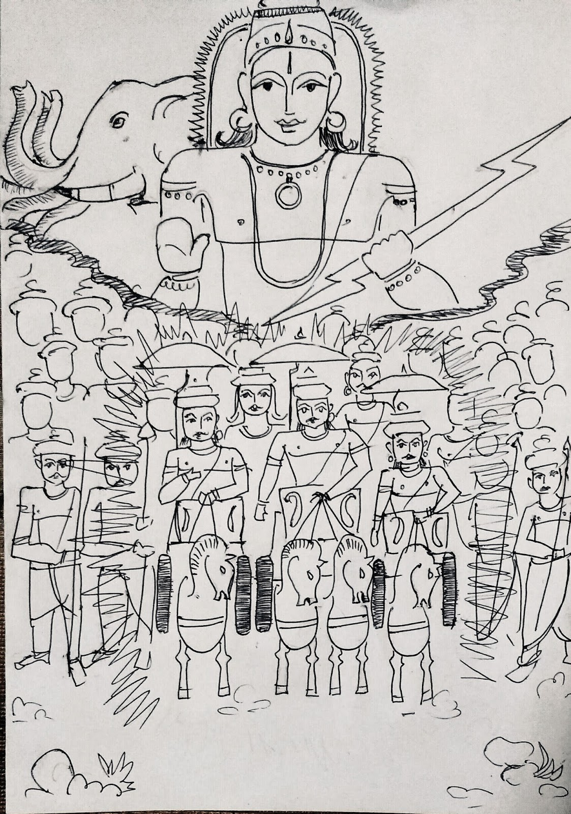

---
title: आश्वसूक्तं  
unicode_script: devanagari  
emphasis_as_inline_comments: true
---   

## ऋक्

RV 8 14_*(634)* 1 a *([सायणो [ऽत्र।](https://archive.org/stream/RgVedaWithSayanasCommentaryPart3/rv_sayanabhasya_part3#page/n707/mode/1up&sa=D&ust=1542425956216000) ऋषिः - आश्वसूक्तिः काण्वगोत्रः। गायत्री। इन्द्रः।])*

यदि॑न्द्रा॒हं यथा॒ त्वमीशी॑य॒ वस्व॒ एक॒ इत् । स्तो॒ता मे॒ गोष॑खा स्यात् १

## साम

- पारम्परिक-गान-मूलम् [अत्र](https://sanskritdocuments.org/sites/pssramanujaswamy/VIVAAHA%20UPANAYANA%20SAAMAANI.pdf&sa=D&ust=1542425956217000)। कौथुमगानम् [अत्र](https://archive.org/details/SamaVedaSanhitaWithSayanabhashyaVolume1SatyavrataSamasrami1874bis/page/n353)।
- गोपालार्यः 2015  

- गोपाल-विश्वासयोर् अनुवचनम् 2018  

- गोपालपवनयोर् अनुवचनम् 2015  

आ*(३)*श्व*(")*-सूक्तम् ।  
आ*([फ]%)*अअआ, औ*(["])*हो*(")*वा*(३)*, हाइ ।  
य*([फ])*द् इन्द्रा*(")*हम् । या*([र])*था*(%)* त्वम्*(३)*।  
ऐ*(["रि])*हियै, इहिई*(-"%३)*।

आ*(["तै])* इशि*(["])*य वास्व । आइक इत्।  
ऐ*(["रि])*हियै, इहिई*(-"%३)*।

आ*([ताप्रे])*ऐ। स्तो*([घि]%)*ता*([प्रे])*अ।  
माइ गो*([प्रे])*ओ। सा*([प?]v३)*खा*(३")*अ।  
सा*(""[पे])*अयाअअ। औ*(["])*हो*(["]%३)*वा*(३-")*आ।

शु*([जॄ])*क्रा*(%३)* आ*(%)*हुता*(")*ह । स्वर्मया*("३)*ह*(v)*॥