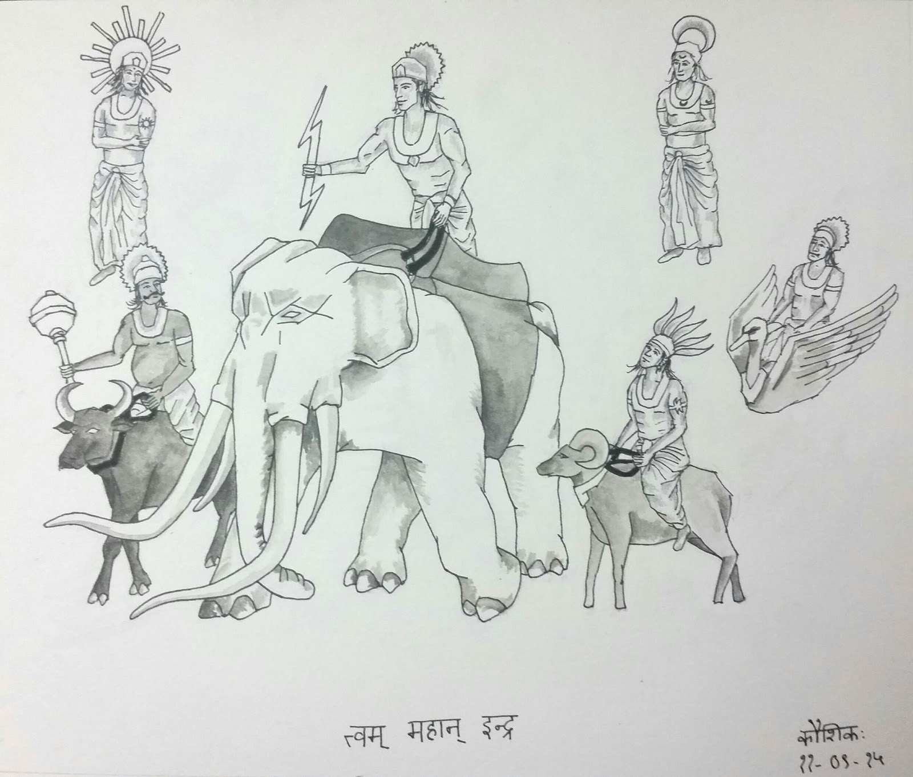

---
title: अञ्जो वैरूपम्  
unicode_script: devanagari  
emphasis_as_inline_comments: true
---   

## ऋक्

RV.8.70.5b; AV;S.20.81.1b; 92.20b; SV.1.278b; 2.212b; TS.2.4.14.3b; KS.12.15b; JB.3.48b; KB.22.4; JUB.1.32.1b,2; N.13.2b.

*([सायणो [ऽत्र](https://archive.org/stream/RgVedaWithSayanasCommentaryPart3/rv_sayanabhasya_part3#page/n911/mode/2up&sa=D&ust=1542425956260000)। पुरुहन्मा। बृहती। इन्द्रः।])*

यद् द्याव *(=द्यौर्लोकाः)* इन्द्र ते *(प्रतिमानाय)* श॒तं श॒तम् भूमीः उ॒त स्युः ।

न त्वा वज्रिन् स॒हस्र॑म् सूर्याः अनु न जा॒तम् अ॑ष्ट॒*(=अश्नुते)* रोद॑सी ।।

## साम

- पारम्परिक-गान-मूलम् [२०१५](https://sanskritdocuments.org/sites/pssramanujaswamy/AASHEERVACHANA%20SAAMAANI.pdf&sa=D&ust=1542425956261000)। १९३७। कौथुमगानम् [अत्र](https://archive.org/details/SamaVedaSanhitaWithSayanabhashyaVolume2SatyavrataSamasrami1876bis_201804/page/n403)।
- रामानुजार्यः 1974 

- गोपालार्यः 2015  

- गोपालपवनयोर् अनुवचनम् 2015  

अञ्जो*(३)* वैरूपम्*(२)*।

य*([प])*द्द्या*(["]%३)* अवै*(३)*,,  
+न्द्र*([पौ]~~द्र~~)* ता*(३)* आउवा*(-""३)*अ, शा*([टृ]%)*ता*(")*अम्।  
हा*([पौ]३”)*अहाअउ वा*(-"”३)*अ, ई*([टृ]%)*डा*(")*अ।  
शा*([र])*तम् भू*(["]%)*मी*(%)*हि*(v)*।  
उ*([पौ])*ता*(३)* आउवा*(-"”३)*अ,  सी*([टृ]%)*यू*(")*हु ।  
हा*([पौ]३”)*अहाअउ वा*(-"”३)*अ। ई*([टृ]%)*डा*(")*अ।  
न*([ते])*त्वा*(३%)* व*(%)*ज्रिन्, सहस्रम्*(%)* सू*(३”)*  
+रि*([पौ])* या*(३)* आउवा*(-"”३)* अ,  आ*([टृ]%)*नू*(")*उ।   
हा*([पौ]३”)*अहाअउ वा*(-"”३)*अ, ई*([टृ]%)*डा*(")*अ।  
न*([त])*जा*(३-%)*तमष्ट*([रा])*,,  
रो*(”)*ओ+आ*([त])*उवा*([त]-"३)*अ, दा*([टृ]%)*सी*(”)*इ।  
हा*([पौ]३”)*अहाअउ वा*(-"”३)*अ, इ*([तॄ])*ट् इडा*(३”)*अ ॥