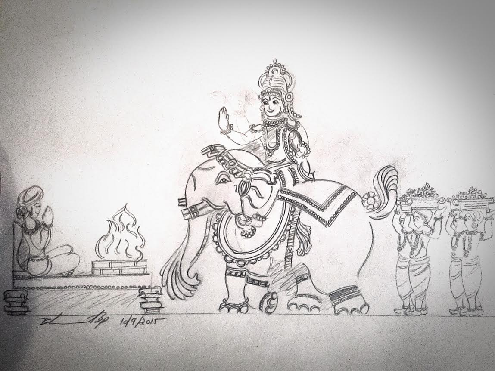

---
title: वामदेव्यम्  
unicode_script: devanagari  
emphasis_as_inline_comments: true
---   

## ऋक्

RV.4.31.1a; AV;S.20.124.1a; SV.1.169a; 2.32a; VS.27.39a; 36.4a; TS.4.2.11.2a; 4.12.5; MS.2.13.9a: 159.4; 4.9.27a: 139.11; KS.21.13; 39.12a; JB.1.140; KB.27.2; GB.2.4.1; PB.11.4.2; 15.10.1; DB.1.14; AA. Introd. 5; TA.4.42.3a; KA.1.219Ha; A;S.2.17.15; 5.16.1; 7.4.2; 8.12.18; 14.18; Vait.42.9; L;S.5.2.12; Ap;S.12.8.5; 17.7.8a; M;S.6.2.3.1; 7.1.1.35; MG.1.5.5; JG.2.9. Ps: kayA nash chitraH ;S;S.7.22.2; ;SG.1.16.6; kayA naH MS.3.16.4: 190.3; 4.10.4: 153.5; KSA.5.21; kayA Rvidh.2.13.4. Designated as kayA-nIyA Svidh.1.6.7; 8.8; 2.3.3; 4.5; as vAmadevyaH *(sch. RTEMPichaH)* GG.4.6.7; 7.34 *(chf. AG.2.6.2)*.

*([सायणो [ऽत्र](https://archive.org/stream/RgVedaWithSayanasCommentaryPart2/rv_sayanabhasya_part2#page/n681/mode/1up&sa=D&ust=1542425956220000)। वामदेव ऋषिः। गायत्री च्छन्दः। इन्द्रो देवता।])*

कया॑ नश्चि॒त्र *(=चयनीयः)* आ भु॑वद् ऊ॒ती *(=तर्पणेन)* स॒दा-वृ॑ध॒ः *(=वर्धमानः)* सखा॑ ।

कया॒ शचि॑ष्ठया *(=प्रज्ञावता)* वृ॒ता *(=वर्तनेन)* १

कस्त्वा॑ स॒त्यो मदा॑नां॒ मंहि॑ष्ठो *(=पूज्यः)* मत्स॒द् *(=मादयेद्)* अन्ध॑सः*(= भोज्यः ([सोमः])*) ।

दृ॒ळहा *(=ढम्)* चि॑दा॒रुजे॒ *(=सम्भङ्क्तुम्)* वसु॑ २

अ॒भी षु ण॒ः सखी॑नामवि॒ता ज॑रितॄ॒णाम् *(=स्तोतॄणाम्)*। श॒तं भ॑वास्यू॒तिभि॑ः *(=रक्षाभिः)*३

*(अभिभवसि = सम्मुखो भवसि)*

## साम - वामदेव्यम्।

- पारम्परिक-गान-मूलम् [अत्र](https://sanskritdocuments.org/sites/pssramanujaswamy/VIVAAHA%20UPANAYANA%20SAAMAANI.pdf&sa=D&ust=1542425956221000)।
- गोपालार्यः 2015  

- गोपालपवनयोर् अनुवचनम् 2015  

वामदेव्यम् ।

का*([टा]%)*याअ । न*([धू])*श्चा*(३)*अइत्राआ*(["])*, भुवात्।

ऊ*([त]%३)*ती*([गो]३)*। सादा*(["])*, वृधस्, सा*(३")*खा*([त]३")*।

औ*([पे])*हो*("३)*हाइ।

क*([तः])*या*(३)*अ +शचाइ,,ष्ठ*([टि])*यौ*(")*हो।

ओ हिं*([ता])*म्मा*([प्रे])*अ।

वा*("३[फफ])*आर्तो*(")*, ओ*(")*हाइ ।।

का*(%)*स्*([टा])* त्वा*(")*अ। स*([धू])*त्यो*(")*ओ, मा*(%)*दा*(%)*नाअम् ।

मां*([त])*,हि*([गो])*ष्ठो*(["])*ओ, मात्साद्, अन्धा*(३")*,, सा*([त]३)*।

औ*([पे])*हो*("३)*हाइ।

दृ*([तः])*ढा*(३)*अ चिदा। रु*([टी])*जौ*(["])*हो*(["])*।

ओ हिं*([ता])*म्मा*([प्रे])*अ।

वा*("३)*आ*([फ])*सो, ओ*(")*हाइ॥

आ*([टा]%)*भिइ । षु*([धू])* णा*(")*अ, स्सा*(%)*अखि, नाअम्।

आ*([त]%)*वि*([घि])*ता*(["])*अ, जराइत्री*(["])*इणा*(३)*म्*([त])* ।

औ*([पे])*हो*("३)*हाइ।

श*([तः])*ता*("३)*अम् भव,,सि*([टी])* यौ*(["])* हो।  
ओ हिं*([ता])*म्मा*([प्रे])*अ।

*(उ)*ता*([फ]"३)*आयो, ओ*(")*हाइ ।।

## साम एकार्चम्

क*([])*यानश्चि त्रा,*([])*आ, आ, भूवा*([])*त् ! ऊ*([])*ती, सदा, वृउ,*([])*धाअ, स्साआ, खाअ*([])*! क*([])*या, शचिष्ठा,*([])*अया, आ,वा, आर्ता, अ ! हावादि नव पर्वा ण्याद्या

निव ! नि*([])*धाइ ! मा*([])*अ ! हाआआ ! औ*([])*होवाअ ! स्व*([])*र्ज्योतीः !